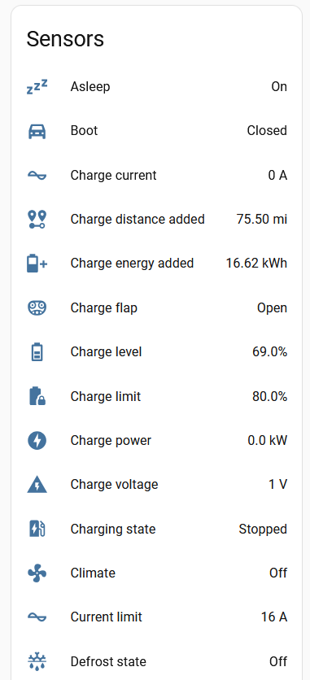
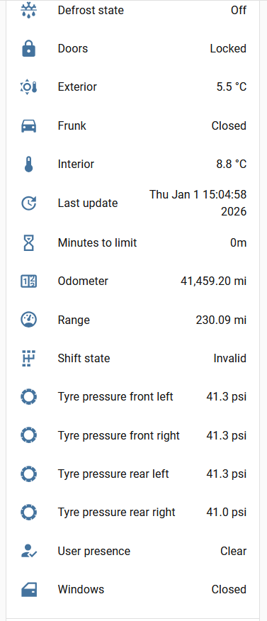
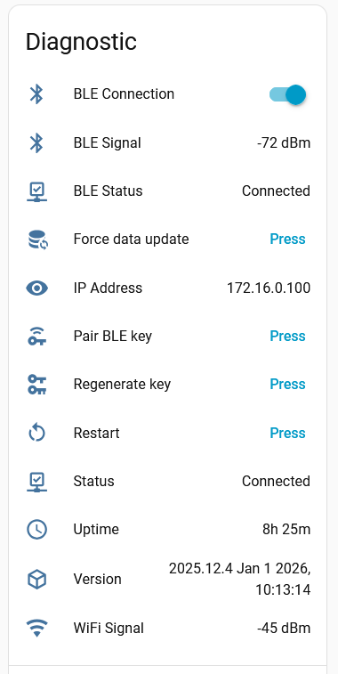

# ESPHome Tesla BLE

[![GitHub Release][releases-shield]][releases]
[![GitHub Activity][commits-shield]][commits]
[![Last Commit][last-commit-shield]][commits]
[![Platform][platform-shield]](https://github.com/esphome)

Control and monitor a Tesla over Bluetooth Low Energy from an ESP32, with native Home Assistant entities via ESPHome.

This is the **Jabe** hard fork of the project ([Jabe/esphome-tesla-ble](https://github.com/Jabe/esphome-tesla-ble)). Historical origin: yoziru → community forks; BLE protocol library dependency remains [PedroKTFC/tesla-ble](https://github.com/PedroKTFC/tesla-ble). This tree is maintained independently with modular packages (Ethernet, Wi‑Fi, optional Fleet API).

| Controls | Sensors-1 | Sensors-2| Diagnostic |
| - | - | - | - |
|  |  |  |  |

## Package composition (start here)

Configs are small **composable packages** — not one mandatory base that hard-codes Wi‑Fi or Ethernet. Your node YAML is a shopping list.

Always start from [`tesla-ble.example.yml`](./tesla-ble.example.yml) (remote packages) or [`tesla-ble.local.yml`](./tesla-ble.local.yml) (local checkout).

### Layout

```
packages/
├── core/
│   ├── base.yml           # esphome, logger, api, ota, external_components
│   ├── ble_tracker.yml    # esp32_ble_tracker
│   └── diagnostics.yml    # uptime, status, BLE presence, restart
├── connectivity/
│   ├── wifi.yml
│   └── ethernet-lan8720.yml
├── features/
│   ├── vehicle.yml        # BLE client + vehicle sensors/controls
│   ├── fleet_api.yml      # optional Fleet API HTTP server (evcc etc.)
│   ├── listener.yml       # optional VIN BLE MAC discovery
│   ├── language_de.yml
│   └── language_hu.yml
└── boards/
    ├── esp32dev.yml
    ├── m5stack-atoms3.yml
    └── m5stack-nanoc6.yml
```

### Wi‑Fi vs Ethernet

Include **exactly one** network package:

```yaml
packages:
  # Ethernet (LAN8720 defaults; override pins with vars if needed)
  network:
    url: github://Jabe/esphome-tesla-ble
    file: packages/connectivity/ethernet-lan8720.yml
    ref: newteslalib
    refresh: 1d
    vars:
      mdc_pin: GPIO23
      mdio_pin: GPIO18
```

```yaml
packages:
  network: github://Jabe/esphome-tesla-ble/packages/connectivity/wifi.yml@newteslalib
```

Do **not** include both. No fork required to switch — change the package line.

### With or without Fleet API

Vehicle control is `features/vehicle.yml`. The HTTP Fleet API mirror is optional:

```yaml
packages:
  vehicle: github://Jabe/esphome-tesla-ble/packages/features/vehicle.yml@newteslalib
  # omit the next line if you only want Home Assistant / BLE entities
  fleet_api: github://Jabe/esphome-tesla-ble/packages/features/fleet_api.yml@newteslalib
```

### Minimal shopping list

| Package | Required? | Role |
| --- | --- | --- |
| `core/base.yml` | yes | Identity, logger, API, OTA, component sources |
| board package | yes | `esp32` board / flash / framework |
| `connectivity/wifi` **or** `ethernet-lan8720` | yes (one) | Network |
| `core/ble_tracker.yml` | yes for vehicle/listener | BLE scan |
| `features/vehicle.yml` | typical | Vehicle entities |
| `core/diagnostics.yml` | recommended | Uptime / BLE status / restart |
| `features/fleet_api.yml` | optional | Fleet API on port 80 |
| `features/listener.yml` | optional | Discover BLE MAC from VIN |
| language package | optional | DE / HU entity names |

Top-level blocks in your node config **deep-merge** into the packages, so most tweaks need neither a fork nor `!extend` — e.g. esp-idf advanced options on top of the board package:

```yaml
esp32:
  framework:
    type: esp-idf
    advanced:
      minimum_chip_revision: "3.0"
      sram1_as_iram: true
```

`!extend` / `!remove` remain available for surgical edits inside package content (e.g. removing an entity by `id`).

## If it doesn't build

> [!TIP]
> **Always** start from [`tesla-ble.example.yml`](./tesla-ble.example.yml) or [`tesla-ble.local.yml`](./tesla-ble.local.yml).

If the build fails in the Home Assistant ESPHome Device Builder:

1. Clean the build files for the device and retry.
2. Use **CLEAN ALL**, then retry.
3. Reinstall the ESPHome add-on if needed.

When opening an issue, include your full YAML and the error portion of the log.

## Features

### Controls

Switches, covers, buttons, numbers, locks (where noted, UI follows sensor state after a short BLE round-trip):

- Open/close boot; open/close charge port flap; open frunk; vent/close windows
- Charger on/off; charging amps; charging limit (%)
- Climate; defrost; steering wheel heater; sentry mode
- Flash lights; sound horn; wake vehicle; lock/unlock; unlatch driver door (disabled by default)
- Unlock charge port

### Vehicle sensors

Always available (VCSEC): asleep/awake, doors locked, user present.

When awake: charge metrics, temperatures, range, odometer, windows, TPMS (disabled by default), etc.

### Diagnostics

- Force data update; pair BLE key; regenerate key; restart board
- BLE signal / BLE connection / BLE presence (timeout via `ble_presence_timeout`, default `30s`)

### Poll configuration

Runtime number/switch entities (disabled by default) mirror YAML poll parameters:

| Entity | YAML parameter |
| --- | --- |
| Post wake poll time | `post_wake_poll_time` |
| Poll data period | `poll_data_period` |
| Poll asleep period | `poll_asleep_period` |
| Poll charging period | `poll_charging_period` |
| BLE disconnected min time | `ble_disconnected_min_time` |
| Fast poll if unlocked | `fast_poll_if_unlocked` |
| Wake on boot | `wake_on_boot` |

Base loop rate `update_interval` is YAML-only (rebuild required).

| Name | Default | Description |
| --- | --- | --- |
| `update_interval` | 10s | Base VCSEC poll; no faster poll can beat this |
| `post_wake_poll_time` | 300 | Seconds of faster data polls after wake |
| `poll_data_period` | 60 | Data poll while awake (during post-wake window) |
| `poll_asleep_period` | 60 | Data poll while asleep / after post-wake |
| `poll_charging_period` | 10 | Data poll while charging |
| `ble_disconnected_min_time` | 300 | Seconds disconnected before sensors → Unknown |
| `fast_poll_if_unlocked` | 0 | `>0` → poll at `update_interval` while unlocked |
| `wake_on_boot` | 0 | `>0` → wake car when the ESP boots |

While a user is present, polls run at `update_interval` and all sensors update.

### Fleet API emulation (optional package)

With `features/fleet_api.yml`, the ESP mirrors a minimal Tesla Fleet API subset for tools like [evcc](https://github.com/evcc-io/evcc).

1. Set `tesla_vin` in `secrets.yaml`.
2. HTTP listens on port `80`.
3. Endpoints include:
   - `GET /api/1/vehicles`, `.../vehicles/{id}`, `.../vehicle_state`, `.../charge_state`, `.../vehicle_data`
   - `POST .../command/charge_start`, `charge_stop`, `set_charging_amps`, HVAC start/stop, `wake_up`

Responses stay minimal for the bundled `docs/evcc` provider.

## Hardware

- Generic ESP32 (`packages/boards/esp32dev.yml`)
- [M5Stack Atom S3](https://docs.m5stack.com/en/core/AtomS3) / S3-Lite
- [M5Stack Nano C6](https://docs.m5stack.com/en/core/M5NanoC6)
- [ESP32 C3 Super Mini](https://www.espboards.dev/esp32/esp32-c3-super-mini/) and similar — set board package / substitutions as needed
- PoE boards with LAN8720 (use `connectivity/ethernet-lan8720.yml`)

## Pre-requisites

**Recommended:** Home Assistant [ESPHome Device Builder](https://esphome.io/guides/getting_started_hassio#installing-esphome-device-builder)

**CLI:** Python 3.10+, GNU Make (optional wrapper)

## Secrets and BLE MAC

Packages never reference `!secret` themselves — your node config supplies the values (via top-level `substitutions` or package `vars`), so secret names are entirely yours. The example config maps them like this — copy `secrets.yaml.example` → `secrets.yaml` and set at least:

- `api_encryption_key`
- `ble_mac_address`, `tesla_vin`
- For Wi‑Fi: `wifi_ssid`, `wifi_password`
- Optional: `ota_password` (OTA auth is off unless you set the `ota_password` substitution)

**VIN** is on the windscreen / Tesla app — not the BLE advertisement name.

Find the BLE MAC with a phone BLE scanner near the car (name often starts with `S`), or flash [`ble-scanner.yml`](./ble-scanner.yml) and watch the logs.

Optional: include `features/listener.yml` with your VIN to log the matching MAC from ESPHome.

## Building and flashing

### Recommended (HA Device Builder)

1. Create a new device from [`tesla-ble.example.yml`](./tesla-ble.example.yml).
2. Choose Wi‑Fi or Ethernet package; include or drop `fleet_api`.
3. Install / OTA from the builder UI.

### Local checkout

```sh
cp secrets.yaml.example secrets.yaml
# edit secrets
make deps
make compile TARGET=tesla-ble.local.yml
make upload TARGET=tesla-ble.local.yml
```

Or: `esphome run tesla-ble.local.yml`

## Home Assistant

1. Settings → Devices & Services → add ESPHome (or accept discovery).
2. Enter the API encryption key from `secrets.yaml`.

## Pairing the BLE key

1. ESP near the car; correct `ble_mac_address` and `tesla_vin`.
2. Sit in the vehicle; press **Pair BLE key** on the device in HA.
3. Tap your NFC card on the console; confirm the pair prompt on the car screen.
4. Under Controls → Locks you should see a new key (rename e.g. to “ESPHome BLE”).


## Miles vs km

Default vehicle units are miles / bar. Change preferred units on the entity in Home Assistant, or use a language package (e.g. DE) that converts distance to km.

## Design notes

Package rules follow [`modern.md`](./modern.md): minimal base, one concern per file, hardware separate from features, package-local defaults overridable with `vars`, pin `ref` + `refresh` on remote packages.

[commits-shield]: https://img.shields.io/github/commit-activity/y/Jabe/esphome-tesla-ble
[commits]: https://github.com/Jabe/esphome-tesla-ble/commits/main
[releases-shield]: https://img.shields.io/github/v/release/Jabe/esphome-tesla-ble
[releases]: https://github.com/Jabe/esphome-tesla-ble/releases
[last-commit-shield]: https://img.shields.io/github/last-commit/Jabe/esphome-tesla-ble
[platform-shield]: https://img.shields.io/badge/platform-Home%20Assistant%20&%20ESPHome-blue
